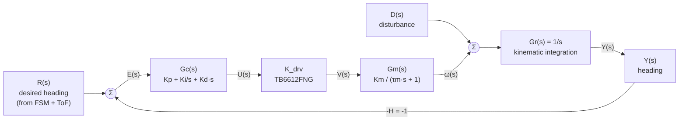

# Signal Flow Graph Analysis of the ESP32-S3 Sumobot ("Heatseeker")

**Course:** CPE335 Sumobot Challenge
**Document type:** Theoretical control-system analysis report
**Status of accompanying hardware:** Under iterative integration and testing.
PID gains have **not** been experimentally tuned at the time of writing.
All numerical parameters quoted in this document are *datasheet-derived
assumptions* used to make the analysis closed-form; they will be replaced
with measured values during the tuning phase.

---

## 1. Executive Summary

This report develops a Signal Flow Graph (SFG) model of the intended
closed-loop motion-control behaviour of the Heatseeker sumobot and applies
**Mason's Gain Formula** to derive its end-to-end transfer function. The
model captures the planned PID heading/velocity controller, the TB6612FNG
motor driver, the N20 gear-motor dynamics, the kinematic integration from
wheel angular velocity to robot heading, and unity-gain sensor feedback.
External effects (opponent contact, surface slip) are modelled as additive
disturbances, while the QTR edge sensor and VL53L0X ToF ring are treated
as a *supervisory* layer that modulates the reference rather than as
classical analog feedback.

The analysis is intentionally derived from the existing firmware
architecture (FSM + planned PID), not from measured data; quantitative
results are therefore *symbolic* with reasonable parameter ranges.

> **Figure 1** *(placeholder — manual insert):* photograph or CAD render
> of the assembled chassis showing sensor placement.

---

## 2. System Description

The Heatseeker is a differential-drive autonomous sumo robot. From a
control-systems perspective the platform is organised in three nested
layers:

| Layer | Purpose | Implementation |
|---|---|---|
| Supervisory (discrete) | Match-state behaviour selection | Finite-state machine in `strategy.cpp` |
| Outer loop (slow, event-driven) | Reference generation from sensors | VL53L0X opponent bearing → desired heading; QTR edge → evasion override |
| Inner loop (continuous, planned) | Motion tracking | PID controller commanding the TB6612FNG / N20 motors |

The current firmware implements the supervisory and outer layers; the
inner PID loop is **architecturally provisioned but not yet active** — the
existing motor commands are fixed PWM values selected by the FSM. The SFG
below describes the *target* control structure that the PID-tuning phase
will populate.

---

## 3. Modelling Assumptions

The following parameters are used only to make the symbolic transfer
function dimensionally consistent. They are taken from manufacturer
datasheets and standard textbook approximations, **not** from measurements
on the actual robot.

| Symbol | Meaning | Assumed value / range | Source |
|---|---|---|---|
| `V_m` | Motor-rail voltage (LM2596 buck output) | 7 – 9 V | Design spec |
| `K_drv` | TB6612FNG PWM→effective-voltage gain | `V_m / 255` ≈ 0.035 V/count | Linear PWM averaging |
| `K_m` | N20 motor speed constant | ≈ 17 rad·s⁻¹·V⁻¹ at the rated 6 V (1000 RPM no-load) | N20 6V/1000RPM datasheet |
| `τ_m` | N20 mechanical time constant | 30 – 100 ms (used τ_m = 0.05 s) | Typical small-DC-motor range |
| `G_r(s)` | Kinematic integration from yaw rate to heading | `1/s` | Differential-drive kinematics |
| `H` | Feedback path gain (unity feedback) | 1 | Direct heading measurement |
| `Kp, Ki, Kd` | PID gains | *Symbolic — to be tuned* | — |

Disturbances modelled:

* `D(s)` — additive torque/velocity disturbance representing opponent
  contact, surface friction variation, and wheel slip.

Sensor paths that are **not** modelled as continuous feedback:

* QTR edge detector — treated as a *priority interrupt* that overrides
  `R(s)` in the supervisory FSM (binary, asynchronous, event-driven).
* VL53L0X ToF ring — treated as a reference generator that produces
  `R(s)` from the opponent bearing. Sample period (25 ms front / 70 ms
  side, continuous mode) is much slower than the inner PID and is
  therefore lumped into `R(s)` rather than into a fast feedback branch.

---

## 4. Block Diagram and Signal Flow Graph

### 4.1 Functional block diagram (Mermaid)



### 4.2 Signal Flow Graph (ASCII)

```
                                              D(s)
                                               │
                                               ▼
                                               ⊕
       +1        Gc(s)        K_drv        Gm(s)       Gr(s)
  R ──────► X1 ────────► X2 ────────► X3 ────────► X4 ────────► Y
            ▲                                                    │
            │                                                    │
            └──────────────────────── −1 ────────────────────────┘
```

Nodes:

* `R`  : input — reference heading/velocity command
* `X1` : error summing node `E(s) = R − H·Y`
* `X2` : controller output `U(s)`
* `X3` : driver output (effective motor voltage) `V(s)`
* `X4` : motor angular velocity `ω(s)` (disturbance enters here)
* `Y`  : output — robot heading

> **Figure 2** *(placeholder — manual insert):* hand-drawn SFG with
> clearly-marked nodes X1–X4, R, Y, and branch gains, suitable for the
> printed report.

### 4.3 Branch inventory

| Branch | From → To | Gain | Physical meaning |
|---|---|---|---|
| b₁ | R → X1 | +1 | Reference injection |
| b₂ | Y → X1 | −H = −1 | Negative unity feedback |
| b₃ | X1 → X2 | `Gc(s) = Kp + Ki/s + Kd·s` | PID controller |
| b₄ | X2 → X3 | `K_drv` | Motor driver (PWM → V_motor) |
| b₅ | X3 → X4 | `Gm(s) = Km / (τm·s + 1)` | DC-motor electromechanical response |
| b₆ | X4 → Y | `Gr(s) = 1/s` | Yaw-rate → heading integration |
| b_d | D → X4 | +1 | Additive disturbance at motor output |

---

## 5. Mason's Gain Formula

### 5.1 General form

For an SFG with input node `R` and output node `Y`:

$$
T(s) = \frac{Y(s)}{R(s)} = \frac{1}{\Delta} \sum_{k} P_k \, \Delta_k
$$

where:

* `Pₖ` = gain of the *k*-th forward path from R to Y
* `Δ`  = graph determinant
  `Δ = 1 − Σ(Lᵢ) + Σ(Lᵢ·Lⱼ)_{non-touching} − Σ(Lᵢ·Lⱼ·Lₖ)_{non-touching} + …`
* `Δₖ` = the value of `Δ` evaluated for the sub-graph that does **not**
  touch path `Pₖ`

### 5.2 Enumeration for the Heatseeker SFG

**Forward paths (R → Y).** Tracing the graph, exactly one forward path
exists:

$$
P_1 = (+1) \cdot G_c(s) \cdot K_{drv} \cdot G_m(s) \cdot G_r(s)
    = G_c(s) \, K_{drv} \, G_m(s) \, G_r(s)
$$

**Individual loops.** Exactly one loop exists — the unity-feedback loop:

$$
L_1 = (-1) \cdot G_c(s) \cdot K_{drv} \cdot G_m(s) \cdot G_r(s)
    = -G_c(s) \, K_{drv} \, G_m(s) \, G_r(s)
$$

**Non-touching loop combinations.** Only one loop exists, so there are
no pairs/triples of non-touching loops; all higher-order terms vanish.

### 5.3 Graph determinant

$$
\Delta = 1 - L_1 = 1 + G_c(s)\,K_{drv}\,G_m(s)\,G_r(s)
$$

### 5.4 Cofactor for path P₁

`L₁` shares nodes X1–X4 and Y with `P₁`, so the loop **touches** the
forward path. Removing all touching loops from Δ leaves only the empty
sub-graph:

$$
\Delta_1 = 1
$$

### 5.5 Closed-loop transfer function

Substituting into Mason's formula:

$$
\boxed{\;T(s) = \frac{Y(s)}{R(s)}
              = \frac{P_1 \Delta_1}{\Delta}
              = \frac{G_c(s)\,K_{drv}\,G_m(s)\,G_r(s)}
                     {1 + G_c(s)\,K_{drv}\,G_m(s)\,G_r(s)}\;}
$$

This is, as expected, the canonical unity-feedback form. The SFG
treatment via Mason confirms — without resorting to block-diagram algebra
— that the planned architecture reduces to a single closed loop with no
non-touching parallelism.

---

## 6. Simplified Transfer Function

Substituting the assumed transfer functions:

$$
G(s) \;\triangleq\; G_c(s) K_{drv} G_m(s) G_r(s)
     = \frac{K_{drv} K_m \, (K_d s^2 + K_p s + K_i)}{s^2(\tau_m s + 1)}
$$

Hence the closed-loop transfer function is third-order in the denominator:

$$
T(s) = \frac{K_{drv} K_m (K_d s^2 + K_p s + K_i)}
            {\tau_m s^3 + s^2 + K_{drv} K_m (K_d s^2 + K_p s + K_i)}
$$

Key structural observations (no numbers because `Kp, Ki, Kd` are still
unset):

* **Type-1 system** — the open-loop transfer `G(s)` already contains a
  pure integrator `1/s` from `Gr(s)`. The PID's integral term adds a
  *second* integrator, which raises the open-loop type to 2 and yields
  zero steady-state error to both step and ramp heading commands at the
  cost of two right-half-plane phase-loss sources.
* **Order** — third order in the denominator; characteristic polynomial
  `τm s³ + s² + K_drv Km (Kd s² + Kp s + Ki) = 0`.
* **Stability** — Routh–Hurwitz on the characteristic polynomial will
  give the admissible `(Kp, Ki, Kd)` region. This is the analytical
  starting point for the tuning workflow (see
  `Control_System_Analysis.md`).

---

## 7. Disturbance Rejection

Setting `R(s) = 0` and computing the closed-loop response from `D(s)` to
`Y(s)`:

$$
\frac{Y(s)}{D(s)} = \frac{G_r(s)}{1 + G_c(s) K_{drv} G_m(s) G_r(s)}
                  = \frac{1/s}{1 + G(s)}
$$

Interpretation:

* At low frequencies, `|G(jω)| → ∞` because of the double integrator
  (Gr's `1/s` and the PID's `Ki/s`). Therefore `Y(jω)/D(jω) → 0`,
  i.e. the controller fully rejects DC disturbances such as a sustained
  opponent push.
* At high frequencies, `Gm(s)` rolls off and the rejection bandwidth is
  bounded by the motor pole `1/τm`. Pushes that arrive faster than ~3 Hz
  (for τm ≈ 50 ms) will momentarily perturb heading before the loop
  closes; this is consistent with the physical expectation that the bot
  briefly yields to a high-force impact.
* The supervisory layer adds a **second, non-linear** disturbance
  rejection mechanism: the QTR edge override pre-empts the inner loop
  before mechanical disturbances can drive the bot off the dohyo.

---

## 8. Mapping the SFG onto the Firmware

| SFG element | Firmware location | Notes |
|---|---|---|
| Reference `R(s)` | `Strategy::update()` driving `driveTowards()` in [src/strategy.cpp](../src/strategy.cpp) | Generated from FSM state + ToF bearing |
| Controller `Gc(s)` | *Provisioned, not yet implemented* — currently fixed-PWM commands in `Motors::forward/turnLeft/...` | Future module `pid.cpp` |
| Driver gain `K_drv` | Direct LEDC PWM at 5 kHz, 8-bit, plus `digitalWrite()` on IN1/IN2/STBY ([src/motors.cpp](../src/motors.cpp)) | Linearised |
| Motor dynamics `Gm(s)` | Physical N20 + gearbox | Not directly modelled in code |
| Kinematic `Gr(s)` | Robot body | Not directly modelled in code (no IMU yet) |
| Feedback `H` | *Not yet closed* — no encoder/IMU. Heading currently inferred only at the supervisory level from ToF bearing changes | Future hardware addition for full inner-loop closure |
| Disturbance `D(s)` | Opponent contact, slip, edge events | Edge events handled in supervisory layer (EVADE state) |

This table is the central honesty disclaimer of the document: the SFG
above describes the **target architecture**. The current firmware
implements every block *except* the continuous inner-loop feedback path —
that completion is the explicit goal of the tuning phase.

---

## 9. Limitations of This Analysis

1. **No experimental identification.** `Km`, `τm`, and the effective
   `K_drv` (including dead-band) have not been measured on the actual
   N20 + TB6612FNG combination. Numerical analyses below rely on
   datasheet ranges only.
2. **Unmodelled non-linearities.** Motor dead-band (low-PWM region
   where the motor does not move), friction stiction, gearbox backlash,
   PWM quantisation, and saturating PWM duty are linear-model exclusions.
3. **No physical inner-loop sensor.** The Heatseeker has no encoder or
   IMU. True closed-loop velocity / heading PID requires adding one (see
   Future Improvements in the presentation outline).
4. **Sensor lumping.** The 25 ms / 70 ms front/side ToF cadence and the
   8 ms QTR cadence are not modelled as sampled-data branches. A more
   complete analysis would use a Z-domain SFG with explicit sample
   periods.
5. **Single-axis simplification.** The full sumobot is a 2-DOF
   differential drive; this report analyses heading only. Longitudinal
   velocity uses an analogous independent loop with the same structure.

---

## 10. Figure Inventory (for manual insertion in printed copy)

| # | Caption | Suggested content |
|---|---|---|
| 1 | Assembled chassis with sensor placement | Photo / render |
| 2 | Hand-drawn SFG | Clean redraw of §4.2 |
| 3 | Closed-loop block diagram | Same content as §4.1 mermaid, vector form |
| 4 | Bode plot of `G(jω)` for assumed parameters | Generated in MATLAB / Python after tuning |
| 5 | Root-locus sketch as `Kp` varies | Hand-sketched or computed |

---

## 11. References

1. K. Ogata, *Modern Control Engineering*, 5th ed., Pearson, 2010 —
   Chapter 3 (Mathematical Modeling), Chapter 8 (PID Controllers).
2. R. C. Dorf and R. H. Bishop, *Modern Control Systems*, 13th ed.,
   Pearson, 2017 — Chapter 2.7 (Signal-Flow Graphs).
3. STMicroelectronics, *VL53L0X World's smallest Time-of-Flight ranging
   and gesture detection sensor*, datasheet rev. 11.
4. Toshiba, *TB6612FNG Dual H-Bridge Driver IC*, datasheet rev. 2008-11.
5. Pololu Corp., *QTR Reflectance Sensors User's Guide* (RC variant
   timing).
6. Espressif Systems, *ESP32-S3 Technical Reference Manual*, v1.4 —
   §6.2 (LEDC), §31 (USB/JTAG).
