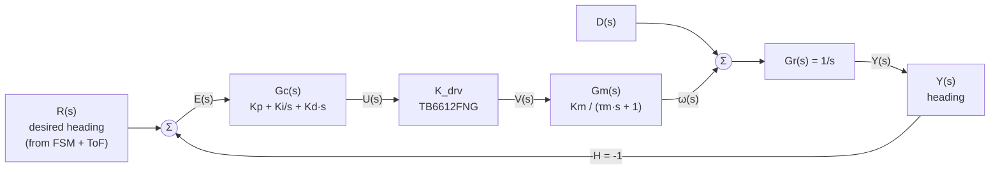

# Signal Flow Graph Analysis — LittleSheep Sumobot

**Course:** CPE335 Sumobot Challenge
**Document type:** Block diagram, signal flow graph (SFG), and Mason's
gain derivation for the sumobot's motion-control structure.
**Status:** The hardware-side controller as built is a **deterministic
FSM + reactive sensor logic** (open-loop motor commands driven by
cached sensor reads). The SFG and Mason derivation below describe the
**target closed-loop PID structure** that the firmware is provisioned
for. Section 8 maps each SFG element to its current realisation:
✅ implemented, 🟡 PID-ready, or ❌ theoretical.

All numerical parameters (`Km`, `τm`, `K_drv`) are datasheet-derived
assumptions, not measurements. PID gains (`Kp`, `Ki`, `Kd`) are
symbolic throughout — no tuned values are claimed.

---

## 1. Executive Summary

The LittleSheep is a differential-drive autonomous sumo robot with a
6-channel VL53L0X opponent ring, a 3-channel QTR edge array, a
TB6612FNG H-bridge, and two TT geared motors, supervised by an
ESP32-S3. We analyse the planned heading-control inner loop using a
signal flow graph: one PID controller `Gc(s)`, one driver gain `K_drv`,
one motor transfer function `Gm(s) = Km / (τm s + 1)`, one kinematic
integrator `Gr(s) = 1/s`, unity feedback, and an additive disturbance
`D(s)` representing opponent contact and slip. Mason's gain formula
reduces the graph to the canonical unity-feedback closed-loop transfer
function `T(s) = G(s) / (1 + G(s))`.

The current firmware exercises the **outer (supervisory) layer** — FSM
state selection, ToF bearing reference, QTR edge override — on
hardware. The inner continuous PID loop is **not** active; today the
FSM issues fixed-PWM motor commands directly via `Motors::drive()`.

---

## 2. System Description

| Layer | Role | Implementation |
|---|---|---|
| Supervisory (discrete) | Match-state behaviour | Deterministic FSM in [`strategy.cpp`](../lib/Sumobot/strategy.cpp) — IDLE → CALIBRATE → COUNTDOWN → SEARCH → ATTACK → EVADE → STOP. |
| Outer (event-driven) | Reference generation from sensors | VL53L0X ring → opponent bearing → desired direction; QTR edge → pre-emptive EVADE override. |
| Inner (continuous, planned) | Motion tracking | PID controller commanding the TB6612FNG → TT-motor pair. **Provisioned, not active.** |

---

## 3. Modelling Assumptions

The parameters below make the SFG dimensionally consistent. They are
**not** measurements.

| Symbol | Meaning | Assumed value | Source |
|---|---|---|---|
| `V_m` | Motor-rail voltage (LM2596 → TB6612FNG VM) | ≈ 6 V | Design spec, 2S pack |
| `K_drv` | TB6612FNG PWM → effective-voltage gain | `V_m / 255` ≈ 0.024 V/count | Linear PWM averaging |
| `K_m` | TT-motor speed constant | ≈ 2.8 rad·s⁻¹·V⁻¹ at 6 V (≈ 160 RPM no-load) | TT motor datasheet |
| `τ_m` | TT-motor mechanical time constant | 50–150 ms (assume τ_m = 0.10 s) | Typical small-DC-geared range |
| `G_r(s)` | Kinematic integration yaw rate → heading | `1/s` | Differential-drive kinematics |
| `H` | Feedback path gain | 1 (unity) | Direct heading measurement (target) |
| `Kp, Ki, Kd` | PID gains | *Symbolic* | To be tuned post-inner-sensor install |

Disturbances modelled:

* `D(s)` — additive torque / velocity disturbance representing opponent
  contact, surface friction variation, and wheel slip at the motor
  output node.

Sensor paths intentionally **not** modelled as continuous feedback:

* QTR edge — treated as a *priority interrupt* that overrides the
  reference at the supervisory layer (binary, asynchronous,
  event-driven; EVADE transition).
* VL53L0X ToF ring — treated as a reference generator that produces
  `R(s)` from opponent bearing. Front cadence 25 ms / side cadence
  70 ms is slower than the inner-loop tick (5 ms) and is therefore
  lumped into `R(s)`, not into a fast feedback branch.

---

## 4. Block Diagram and Signal Flow Graph

### 4.1 Functional block diagram



### 4.2 Signal Flow Graph (ASCII)

```
                                              D(s)
                                               │
                                               ▼
                                               ⊕
       +1        Gc(s)        K_drv        Gm(s)       Gr(s)
  R ──────► X1 ────────► X2 ────────► X3 ────────► X4 ────────► Y
            ▲                                                    │
            │                                                    │
            └──────────────────────── −1 ────────────────────────┘
```

Nodes:

* `R`  — reference heading command
* `X1` — error summing node `E(s) = R − H·Y`
* `X2` — controller output `U(s)`
* `X3` — driver output (effective motor voltage) `V(s)`
* `X4` — motor angular velocity `ω(s)` (disturbance enters here)
* `Y`  — output: robot heading

### 4.3 Branch inventory

| Branch | From → To | Gain | Physical meaning |
|---|---|---|---|
| b₁ | R → X1 | +1 | Reference injection |
| b₂ | Y → X1 | −H = −1 | Negative unity feedback |
| b₃ | X1 → X2 | `Gc(s) = Kp + Ki/s + Kd·s` | PID controller |
| b₄ | X2 → X3 | `K_drv` | TB6612FNG PWM → V_motor |
| b₅ | X3 → X4 | `Gm(s) = Km / (τm·s + 1)` | DC-motor electromechanical response |
| b₆ | X4 → Y | `Gr(s) = 1/s` | Yaw-rate → heading integration |
| b_d | D → X4 | +1 | Additive disturbance at motor output |

---

## 5. Mason's Gain Formula

### 5.1 General form

For an SFG with input `R` and output `Y`:

$$
T(s) = \frac{Y(s)}{R(s)} = \frac{1}{\Delta} \sum_{k} P_k \, \Delta_k
$$

* `Pₖ` — gain of the *k*-th forward path from `R` to `Y`
* `Δ`  — graph determinant
  `Δ = 1 − Σ Lᵢ + Σ(Lᵢ Lⱼ)_{non-touching} − …`
* `Δₖ` — `Δ` evaluated on the sub-graph that does **not** touch `Pₖ`

### 5.2 Forward paths

There is exactly one path from `R` to `Y`:

$$
P_1 = (+1) \cdot G_c(s) \cdot K_{drv} \cdot G_m(s) \cdot G_r(s)
    = G_c(s)\,K_{drv}\,G_m(s)\,G_r(s)
$$

### 5.3 Loops

There is exactly one loop — the negative-unity-feedback loop:

$$
L_1 = (-1) \cdot G_c(s) \cdot K_{drv} \cdot G_m(s) \cdot G_r(s)
    = -G_c(s)\,K_{drv}\,G_m(s)\,G_r(s)
$$

No second loop exists, so all non-touching loop products vanish.

### 5.4 Graph determinant and cofactor

$$
\Delta = 1 - L_1 = 1 + G_c(s)\,K_{drv}\,G_m(s)\,G_r(s)
$$

`L₁` shares every node with `P₁`, so the loop *touches* the forward
path. Removing the touching loop from `Δ` leaves the empty sub-graph:

$$
\Delta_1 = 1
$$

### 5.5 Closed-loop transfer function

$$
\boxed{\;T(s) = \frac{Y(s)}{R(s)}
              = \frac{P_1 \Delta_1}{\Delta}
              = \frac{G_c(s)\,K_{drv}\,G_m(s)\,G_r(s)}
                     {1 + G_c(s)\,K_{drv}\,G_m(s)\,G_r(s)}\;}
$$

The canonical unity-feedback form. Mason's formula confirms — without
block-algebra manipulation — that the planned architecture reduces to
a single closed loop with no non-touching parallelism.

---

## 6. Simplified Transfer Function

Substituting the assumed plant transfer functions:

$$
G(s) \;\triangleq\; G_c(s)\,K_{drv}\,G_m(s)\,G_r(s)
     = \frac{K_{drv}\,K_m\,(K_d s^2 + K_p s + K_i)}{s^2(\tau_m s + 1)}
$$

So the closed-loop transfer function is third-order in the denominator:

$$
T(s) = \frac{K_{drv}\,K_m\,(K_d s^2 + K_p s + K_i)}
            {\tau_m\,s^3 + s^2 + K_{drv}\,K_m\,(K_d s^2 + K_p s + K_i)}
$$

Structural observations (no numbers — `Kp, Ki, Kd` are symbolic):

* **System type.** `G_r(s) = 1/s` already gives an integrator; the PID
  integral term adds a second. The open-loop type therefore becomes 2,
  yielding zero steady-state error to both step and ramp heading
  references, at the cost of two right-half-plane phase-loss sources.
* **Order.** Third in the denominator; characteristic polynomial
  `τm s³ + s² + K_drv Km (Kd s² + Kp s + Ki) = 0`.
* **Stability.** Routh–Hurwitz on the characteristic polynomial bounds
  the admissible `(Kp, Ki, Kd)` region. This is the analytical starting
  point for the tuning workflow in
  [`Control_System_Analysis.md`](Control_System_Analysis.md) §2.

---

## 7. Disturbance Rejection

Setting `R(s) = 0` and tracing `D(s) → Y(s)`:

$$
\frac{Y(s)}{D(s)} = \frac{G_r(s)}{1 + G(s)} = \frac{1/s}{1 + G(s)}
$$

Interpretation:

* At low frequency `|G(jω)| → ∞` (double integrator from `Gr` and the
  PID `Ki/s`), so `Y(jω)/D(jω) → 0` — the controller fully rejects DC
  disturbances such as a sustained opponent push.
* At high frequency `Gm(s)` rolls off; rejection bandwidth is bounded by
  `1/τm`. Pushes faster than ~1.5 Hz (for τm = 100 ms) momentarily
  perturb heading before the loop closes.
* The supervisory layer adds a **second, non-linear** disturbance
  rejection mechanism: the QTR edge override forces an EVADE transition
  before mechanical disturbances can drive the bot off the dohyo.

---

## 8. SFG → Firmware Mapping (honest status)

This table is the central honesty disclaimer. The SFG above describes
the **target architecture**. The firmware **as built** implements the
structural skeleton — the inner continuous loop is provisioned but not
closed.

| SFG element | Firmware artefact | Status |
|---|---|---|
| Reference `R(s)` | FSM in [`strategy.cpp`](../lib/Sumobot/strategy.cpp); `driveTowards()` maps `OpponentDir` to a differential-drive command | ✅ Implemented |
| Summing junction `R − H·Y` | Implicit in the planned PID; the FSM currently issues commands without a measured `Y` | 🟡 PID-ready |
| Controller `Gc(s)` | Not implemented. Today the FSM issues fixed-PWM via `Motors::forward / turnLeft / turnRight / drive`. The `Movement` calibration layer adds open-loop trim + pivot-by-degree, also not a PID. | ❌ Theoretical |
| Driver gain `K_drv` | TB6612FNG via direct ESP32 LEDC PWM (5 kHz / 8-bit) + `digitalWrite()` on IN1/IN2/STBY ([`motors.cpp`](../lib/Sumobot/motors.cpp)) | ✅ Implemented |
| Motor dynamics `Gm(s)` | Physical TT gear motor (6 V / 160 RPM L-shape) | ✅ Hardware |
| Kinematic integrator `Gr(s)` | Robot body (yaw rate → heading) | ✅ Hardware |
| Feedback path `H` | **Not closed.** No encoder, no IMU. ToF bearing acts as a slow event-driven reference at the supervisory layer, not as continuous heading feedback. | ❌ Open |
| Disturbance `D(s)` | Opponent contact, slip; handled non-linearly by EVADE pre-emption | ✅ Supervisory only |

### 8.1 Why the FSM is not in the SFG

Mason's formula applies to a single linear graph. The FSM operates on a
slower, discrete time-scale: it sets the *reference* `R(s)` and the
*structure* (which state's behaviour applies), then hands off to the
linear inner loop. In control-theory language the FSM is a
**supervisory mode-switching controller**; classical SFG analysis
applies *within each mode*.

### 8.2 Honest statement of the current state

> The LittleSheep firmware implements the structural skeleton of the
> control system depicted in the SFG. The outer supervisory loop is
> exercised on hardware. The inner continuous loop is wired and
> "PID-ready" — the motor abstraction supports signed differential
> drive, the loop runs at a deterministic 5 ms tick, and the
> `Movement` layer is positioned to compose a PID output with the
> existing open-loop trim — but no PID is in the code today.
> Closing the inner loop requires (a) an inner-loop sensor (wheel
> encoder or IMU) and (b) a `pid.cpp` module that consumes its filtered
> measurement. Until then, the SFG below the supervisory layer is a
> **design target**, not a description of present behaviour.

---

## 9. Limitations of This Analysis

1. **No experimental identification.** `Km`, `τm`, and the effective
   `K_drv` (including dead-band) have not been measured on the actual
   TT + TB6612FNG combination.
2. **Unmodelled non-linearities.** Motor dead-band (low-PWM region with
   no rotation), friction stiction, gearbox backlash, PWM
   quantisation, and saturating duty are linear-model exclusions.
3. **No physical inner-loop sensor.** No encoder, no IMU; true
   continuous-time closed-loop velocity / heading PID is not possible
   in the current build.
4. **Sampled-data lumping.** The 25 / 70 / 8 ms sensor cadences are not
   modelled as Z-domain sample-and-hold branches; they are lumped into
   the reference path on the grounds that their periods are short
   compared with `τm`.
5. **Single-axis simplification.** Heading only. Longitudinal velocity
   would use an analogous independent loop with the same structure.

---

## 10. Figure Inventory (for the printed report)

| # | Caption | Suggested content |
|---|---|---|
| 1 | Assembled chassis with sensor placement | Photo / render |
| 2 | Hand-drawn SFG | Clean redraw of §4.2 |
| 3 | Block diagram | §4.1 mermaid, rendered |
| 4 | Bode plot of `G(jω)` for assumed parameters | Generated in MATLAB / Python after tuning |
| 5 | Root-locus sketch as `Kp` varies | Hand-sketched or computed |

---

## 11. References

1. K. Ogata, *Modern Control Engineering*, 5th ed., Pearson, 2010 —
   Chapter 3, Chapter 8.
2. R. C. Dorf & R. H. Bishop, *Modern Control Systems*, 13th ed.,
   Pearson, 2017 — Chapter 2.7 (Signal-Flow Graphs).
3. STMicroelectronics, *VL53L0X World's Smallest ToF Ranging Sensor*,
   datasheet rev. 11.
4. Toshiba, *TB6612FNG Dual H-Bridge Driver IC*, datasheet rev.
   2008-11.
5. Pololu Corp., *QTR Reflectance Sensors User's Guide* (RC variant).
6. Espressif Systems, *ESP32-S3 Technical Reference Manual*, v1.4 —
   §6.2 (LEDC).
